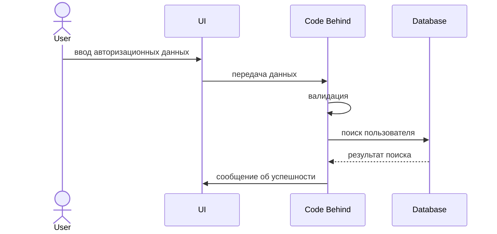

Задание
---
Магазин для животных

Автор
---
Николаев Вячеслав Алексеевич ИП-20-3

Схема БД
---

---
Диаграмма последовательности для прецендента авторизация
---

---
Скрипт БД
---
```
USE [User5_NikolaevV2]
GO
SET IDENTITY_INSERT [dbo].[PunktVidachis] ON 

INSERT [dbo].[PunktVidachis] ([Id], [Index], [City], [Street], [Nomer]) VALUES (1, N'344288', N' г. Ангарск', N' ул. Чехова', 1)
INSERT [dbo].[PunktVidachis] ([Id], [Index], [City], [Street], [Nomer]) VALUES (2, N'614164', N' г.Ангарск', N'  ул. Степная', 30)
INSERT [dbo].[PunktVidachis] ([Id], [Index], [City], [Street], [Nomer]) VALUES (3, N'394242', N' г. Ангарск', N' ул. Коммунистическая', 43)
INSERT [dbo].[PunktVidachis] ([Id], [Index], [City], [Street], [Nomer]) VALUES (4, N'660540', N' г. Ангарск', N' ул. Солнечная', 25)
INSERT [dbo].[PunktVidachis] ([Id], [Index], [City], [Street], [Nomer]) VALUES (5, N'125837', N' г. Ангарск', N' ул. Шоссейная', 40)
INSERT [dbo].[PunktVidachis] ([Id], [Index], [City], [Street], [Nomer]) VALUES (6, N'125703', N' г. Ангарск', N' ул. Партизанская', 49)
INSERT [dbo].[PunktVidachis] ([Id], [Index], [City], [Street], [Nomer]) VALUES (7, N'625283', N' г. Ангарск', N' ул. Победы', 46)
INSERT [dbo].[PunktVidachis] ([Id], [Index], [City], [Street], [Nomer]) VALUES (8, N'614611', N' г. Ангарск', N' ул. Молодежная', 50)
INSERT [dbo].[PunktVidachis] ([Id], [Index], [City], [Street], [Nomer]) VALUES (9, N'454311', N' г.Ангарск', N' ул. Новая', 19)
INSERT [dbo].[PunktVidachis] ([Id], [Index], [City], [Street], [Nomer]) VALUES (10, N'660007', N' г.Ангарск', N' ул. Октябрьская', 19)
INSERT [dbo].[PunktVidachis] ([Id], [Index], [City], [Street], [Nomer]) VALUES (11, N'603036', N' г. Ангарск', N' ул. Садовая', 4)
INSERT [dbo].[PunktVidachis] ([Id], [Index], [City], [Street], [Nomer]) VALUES (12, N'450983', N' г.Ангарск', N' ул. Комсомольская', 26)
INSERT [dbo].[PunktVidachis] ([Id], [Index], [City], [Street], [Nomer]) VALUES (13, N'394782', N' г. Ангарск', N' ул. Чехова', 3)
INSERT [dbo].[PunktVidachis] ([Id], [Index], [City], [Street], [Nomer]) VALUES (14, N'603002', N' г. Ангарск', N' ул. Дзержинского', 28)
INSERT [dbo].[PunktVidachis] ([Id], [Index], [City], [Street], [Nomer]) VALUES (15, N'450558', N' г. Ангарск', N' ул. Набережная', 30)
INSERT [dbo].[PunktVidachis] ([Id], [Index], [City], [Street], [Nomer]) VALUES (16, N'394060', N' г.Ангарск', N' ул. Фрунзе', 43)
INSERT [dbo].[PunktVidachis] ([Id], [Index], [City], [Street], [Nomer]) VALUES (17, N'410661', N' г. Ангарск', N' ул. Школьная', 50)
INSERT [dbo].[PunktVidachis] ([Id], [Index], [City], [Street], [Nomer]) VALUES (18, N'625590', N' г. Ангарск', N' ул. Коммунистическая', 20)
INSERT [dbo].[PunktVidachis] ([Id], [Index], [City], [Street], [Nomer]) VALUES (19, N'625683', N' г. Ангарск', N' ул. Марта', 8)
INSERT [dbo].[PunktVidachis] ([Id], [Index], [City], [Street], [Nomer]) VALUES (20, N'400562', N' г. Ангарск', N' ул. Зеленая', 32)
INSERT [dbo].[PunktVidachis] ([Id], [Index], [City], [Street], [Nomer]) VALUES (21, N'614510', N' г. Ангарск', N' ул. Маяковского', 47)
INSERT [dbo].[PunktVidachis] ([Id], [Index], [City], [Street], [Nomer]) VALUES (22, N'410542', N' г. Ангарск', N' ул. Светлая', 46)
INSERT [dbo].[PunktVidachis] ([Id], [Index], [City], [Street], [Nomer]) VALUES (23, N'620839', N' г. Ангарск', N' ул. Цветочная', 8)
INSERT [dbo].[PunktVidachis] ([Id], [Index], [City], [Street], [Nomer]) VALUES (24, N'443890', N' г. Ангарск', N' ул. Коммунистическая', 1)
INSERT [dbo].[PunktVidachis] ([Id], [Index], [City], [Street], [Nomer]) VALUES (25, N'603379', N' г. Ангарск', N' ул. Спортивная', 46)
INSERT [dbo].[PunktVidachis] ([Id], [Index], [City], [Street], [Nomer]) VALUES (26, N'603721', N' г. Ангарск', N' ул. Гоголя', 41)
INSERT [dbo].[PunktVidachis] ([Id], [Index], [City], [Street], [Nomer]) VALUES (27, N'410172', N' г. Ангарск', N' ул. Северная', 13)
INSERT [dbo].[PunktVidachis] ([Id], [Index], [City], [Street], [Nomer]) VALUES (28, N'420151', N' г. Ангарск', N' ул. Вишневая', 32)
INSERT [dbo].[PunktVidachis] ([Id], [Index], [City], [Street], [Nomer]) VALUES (29, N'125061', N' г. Ангарск', N' ул. Подгорная', 8)
INSERT [dbo].[PunktVidachis] ([Id], [Index], [City], [Street], [Nomer]) VALUES (30, N'630370', N' г. Ангарск', N' ул. Шоссейная', 24)
INSERT [dbo].[PunktVidachis] ([Id], [Index], [City], [Street], [Nomer]) VALUES (31, N'614753', N' г. Ангарск', N' ул. Полевая', 35)
INSERT [dbo].[PunktVidachis] ([Id], [Index], [City], [Street], [Nomer]) VALUES (32, N'426030', N' г. Ангарск', N' ул. Маяковского', 44)
INSERT [dbo].[PunktVidachis] ([Id], [Index], [City], [Street], [Nomer]) VALUES (33, N'450375', N' г. Ангарск', N'ул. Клубная', 44)
INSERT [dbo].[PunktVidachis] ([Id], [Index], [City], [Street], [Nomer]) VALUES (34, N'625560', N' г. Ангарск', N' ул. Некрасова', 12)
INSERT [dbo].[PunktVidachis] ([Id], [Index], [City], [Street], [Nomer]) VALUES (35, N'630201', N' г. Ангарск', N' ул. Комсомольская', 17)
INSERT [dbo].[PunktVidachis] ([Id], [Index], [City], [Street], [Nomer]) VALUES (36, N'190949', N' г. Ангарск', N' ул. Мичурина', 26)
SET IDENTITY_INSERT [dbo].[PunktVidachis] OFF
GO
SET IDENTITY_INSERT [dbo].[Status] ON 

INSERT [dbo].[Status] ([Id], [Name]) VALUES (1, N'Новый')
INSERT [dbo].[Status] ([Id], [Name]) VALUES (2, N'Завершен')
SET IDENTITY_INSERT [dbo].[Status] OFF
GO
SET IDENTITY_INSERT [dbo].[Orders] ON 

INSERT [dbo].[Orders] ([Nomer], [DateOrder], [DateSupplier], [PunktVidachiId], [FIOClient], [Code], [StatusId]) VALUES (1, CAST(N'2022-05-04T00:00:00.0000000+03:00' AS DateTimeOffset), CAST(N'2022-05-10T00:00:00.0000000+03:00' AS DateTimeOffset), 24, N'Новиков Матвей Маркович', 201, 1)
INSERT [dbo].[Orders] ([Nomer], [DateOrder], [DateSupplier], [PunktVidachiId], [FIOClient], [Code], [StatusId]) VALUES (2, CAST(N'2022-05-05T00:00:00.0000000+03:00' AS DateTimeOffset), CAST(N'2022-05-11T00:00:00.0000000+03:00' AS DateTimeOffset), 25, N'', 202, 1)
INSERT [dbo].[Orders] ([Nomer], [DateOrder], [DateSupplier], [PunktVidachiId], [FIOClient], [Code], [StatusId]) VALUES (3, CAST(N'2022-05-06T00:00:00.0000000+03:00' AS DateTimeOffset), CAST(N'2022-05-12T00:00:00.0000000+03:00' AS DateTimeOffset), 26, N'Соловьев Пётр Никитич', 203, 1)
INSERT [dbo].[Orders] ([Nomer], [DateOrder], [DateSupplier], [PunktVidachiId], [FIOClient], [Code], [StatusId]) VALUES (4, CAST(N'2022-05-07T00:00:00.0000000+03:00' AS DateTimeOffset), CAST(N'2022-05-13T00:00:00.0000000+03:00' AS DateTimeOffset), 27, N'', 204, 1)
INSERT [dbo].[Orders] ([Nomer], [DateOrder], [DateSupplier], [PunktVidachiId], [FIOClient], [Code], [StatusId]) VALUES (5, CAST(N'2022-05-08T00:00:00.0000000+03:00' AS DateTimeOffset), CAST(N'2022-05-14T00:00:00.0000000+03:00' AS DateTimeOffset), 28, N'Васильева Софья Глебовна', 205, 1)
INSERT [dbo].[Orders] ([Nomer], [DateOrder], [DateSupplier], [PunktVidachiId], [FIOClient], [Code], [StatusId]) VALUES (6, CAST(N'2022-05-09T00:00:00.0000000+03:00' AS DateTimeOffset), CAST(N'2022-05-15T00:00:00.0000000+03:00' AS DateTimeOffset), 29, N'', 206, 1)
INSERT [dbo].[Orders] ([Nomer], [DateOrder], [DateSupplier], [PunktVidachiId], [FIOClient], [Code], [StatusId]) VALUES (7, CAST(N'2022-05-10T00:00:00.0000000+03:00' AS DateTimeOffset), CAST(N'2022-05-16T00:00:00.0000000+03:00' AS DateTimeOffset), 30, N'', 207, 1)
INSERT [dbo].[Orders] ([Nomer], [DateOrder], [DateSupplier], [PunktVidachiId], [FIOClient], [Code], [StatusId]) VALUES (8, CAST(N'2022-05-11T00:00:00.0000000+03:00' AS DateTimeOffset), CAST(N'2022-05-17T00:00:00.0000000+03:00' AS DateTimeOffset), 31, N'', 208, 1)
INSERT [dbo].[Orders] ([Nomer], [DateOrder], [DateSupplier], [PunktVidachiId], [FIOClient], [Code], [StatusId]) VALUES (9, CAST(N'2022-05-12T00:00:00.0000000+03:00' AS DateTimeOffset), CAST(N'2022-05-18T00:00:00.0000000+03:00' AS DateTimeOffset), 32, N'Львов Роман Павлович', 209, 1)
INSERT [dbo].[Orders] ([Nomer], [DateOrder], [DateSupplier], [PunktVidachiId], [FIOClient], [Code], [StatusId]) VALUES (10, CAST(N'2022-05-13T00:00:00.0000000+03:00' AS DateTimeOffset), CAST(N'2022-05-19T00:00:00.0000000+03:00' AS DateTimeOffset), 33, N'', 210, 2)
SET IDENTITY_INSERT [dbo].[Orders] OFF
GO
SET IDENTITY_INSERT [dbo].[Suppliers] ON 

INSERT [dbo].[Suppliers] ([Id], [Name]) VALUES (1, N'Летуаль')
INSERT [dbo].[Suppliers] ([Id], [Name]) VALUES (2, N'Рив Гош')
SET IDENTITY_INSERT [dbo].[Suppliers] OFF
GO
SET IDENTITY_INSERT [dbo].[Manufacturers] ON 

INSERT [dbo].[Manufacturers] ([Id], [Name]) VALUES (1, N'Dragon')
INSERT [dbo].[Manufacturers] ([Id], [Name]) VALUES (2, N'Paris Line')
INSERT [dbo].[Manufacturers] ([Id], [Name]) VALUES (3, N'Parfums Constantine')
INSERT [dbo].[Manufacturers] ([Id], [Name]) VALUES (4, N'Today Parfum')
INSERT [dbo].[Manufacturers] ([Id], [Name]) VALUES (5, N'Dilis Parfum')
INSERT [dbo].[Manufacturers] ([Id], [Name]) VALUES (6, N'TRUSSARDI')
INSERT [dbo].[Manufacturers] ([Id], [Name]) VALUES (7, N'Yves de Sistelle')
INSERT [dbo].[Manufacturers] ([Id], [Name]) VALUES (8, N'HUGO BOSS')
INSERT [dbo].[Manufacturers] ([Id], [Name]) VALUES (9, N'DOLCE & GABBANA')
INSERT [dbo].[Manufacturers] ([Id], [Name]) VALUES (10, N'LACOSTE')
SET IDENTITY_INSERT [dbo].[Manufacturers] OFF
GO
INSERT [dbo].[ProductTypes] ([Articul], [Name], [Init], [Price], [MaxDiscount], [SupplierId], [CategoryType], [Discount], [CountInPack], [Description], [ImagePreview], [ManufacturerId]) VALUES (N'A436H7', N'Туалетная вода', N'шт.', CAST(1000.00 AS Decimal(18, 2)), 15, 1, 1, 4, 12, N'Туалетная вода Dilis Parfum Aqua Cool, 100 мл', N'', 5)
INSERT [dbo].[ProductTypes] ([Articul], [Name], [Init], [Price], [MaxDiscount], [SupplierId], [CategoryType], [Discount], [CountInPack], [Description], [ImagePreview], [ManufacturerId]) VALUES (N'C323R4', N'Парфюмерная вода', N'шт.', CAST(4100.00 AS Decimal(18, 2)), 25, 1, 1, 4, 8, N'Парфюмерная вода TRUSSARDI Donna Trussardi (2011), 50 мл', N'', 6)
INSERT [dbo].[ProductTypes] ([Articul], [Name], [Init], [Price], [MaxDiscount], [SupplierId], [CategoryType], [Discount], [CountInPack], [Description], [ImagePreview], [ManufacturerId]) VALUES (N'D344Y7', N'Парфюмерная вода', N'шт.', CAST(223.00 AS Decimal(18, 2)), 10, 1, 2, 5, 16, N'Парфюмерная вода Today Parfum Prestige №6 Eclat, 17 мл', N'D344Y7.jpg', 4)
INSERT [dbo].[ProductTypes] ([Articul], [Name], [Init], [Price], [MaxDiscount], [SupplierId], [CategoryType], [Discount], [CountInPack], [Description], [ImagePreview], [ManufacturerId]) VALUES (N'D378D3', N'Туалетная вода', N'шт.', CAST(1500.00 AS Decimal(18, 2)), 10, 1, 2, 3, 16, N'Духи Dilis Parfum Classic Collection №18, 30 мл', N'D378D3.jpg', 5)
INSERT [dbo].[ProductTypes] ([Articul], [Name], [Init], [Price], [MaxDiscount], [SupplierId], [CategoryType], [Discount], [CountInPack], [Description], [ImagePreview], [ManufacturerId]) VALUES (N'D526R4', N'Парфюмерная вода', N'шт.', CAST(3600.00 AS Decimal(18, 2)), 10, 1, 2, 3, 6, N'Парфюмерная вода DOLCE & GABBANA Dolce&Gabbana pour', N'', 9)
INSERT [dbo].[ProductTypes] ([Articul], [Name], [Init], [Price], [MaxDiscount], [SupplierId], [CategoryType], [Discount], [CountInPack], [Description], [ImagePreview], [ManufacturerId]) VALUES (N'D634D4', N'Туалетная вода', N'шт.', CAST(367.00 AS Decimal(18, 2)), 15, 2, 1, 2, 14, N'Туалетная вода Paris Line Parfums Dollar Diamond, 100 мл', N'', 2)
INSERT [dbo].[ProductTypes] ([Articul], [Name], [Init], [Price], [MaxDiscount], [SupplierId], [CategoryType], [Discount], [CountInPack], [Description], [ImagePreview], [ManufacturerId]) VALUES (N'E245R5', N'Туалетная вода', N'шт.', CAST(1000.00 AS Decimal(18, 2)), 15, 2, 2, 5, 2, N'Туалетная вода Dilis Parfum Mila, 100 мл', N'E245R5.jpg', 5)
INSERT [dbo].[ProductTypes] ([Articul], [Name], [Init], [Price], [MaxDiscount], [SupplierId], [CategoryType], [Discount], [CountInPack], [Description], [ImagePreview], [ManufacturerId]) VALUES (N'E479G6', N'Туалетная вода', N'шт.', CAST(6100.00 AS Decimal(18, 2)), 25, 2, 1, 5, 3, N'Туалетная вода HUGO BOSS Boss Bottled, 100 мл', N'', 8)
INSERT [dbo].[ProductTypes] ([Articul], [Name], [Init], [Price], [MaxDiscount], [SupplierId], [CategoryType], [Discount], [CountInPack], [Description], [ImagePreview], [ManufacturerId]) VALUES (N'E530Y6', N'Парфюмерная вода', N'шт.', CAST(519.00 AS Decimal(18, 2)), 15, 1, 2, 3, 9, N'Парфюмерная вода Parfums Constantine Mademoiselle 5, 50 мл', N'E530Y6.jpg', 3)
INSERT [dbo].[ProductTypes] ([Articul], [Name], [Init], [Price], [MaxDiscount], [SupplierId], [CategoryType], [Discount], [CountInPack], [Description], [ImagePreview], [ManufacturerId]) VALUES (N'E573G6', N'Духи', N'шт.', CAST(1087.00 AS Decimal(18, 2)), 15, 2, 2, 5, 13, N'Духи Dilis Parfum Classic Collection №34, 30 мл', N'', 5)
INSERT [dbo].[ProductTypes] ([Articul], [Name], [Init], [Price], [MaxDiscount], [SupplierId], [CategoryType], [Discount], [CountInPack], [Description], [ImagePreview], [ManufacturerId]) VALUES (N'F344S4', N'Туалетная вода', N'шт.', CAST(546.00 AS Decimal(18, 2)), 5, 2, 2, 2, 9, N'Туалетная вода Today Parfum Cola Cherry, 50 мл', N'', 4)
INSERT [dbo].[ProductTypes] ([Articul], [Name], [Init], [Price], [MaxDiscount], [SupplierId], [CategoryType], [Discount], [CountInPack], [Description], [ImagePreview], [ManufacturerId]) VALUES (N'F346G5', N'Туалетная вода', N'шт.', CAST(450.00 AS Decimal(18, 2)), 5, 2, 2, 3, 18, N'Туалетная вода Today Parfum G-Club Egoist, 100 мл', N'F346G5.jpg', 4)
INSERT [dbo].[ProductTypes] ([Articul], [Name], [Init], [Price], [MaxDiscount], [SupplierId], [CategoryType], [Discount], [CountInPack], [Description], [ImagePreview], [ManufacturerId]) VALUES (N'F893T5', N'Туалетная вода', N'шт.', CAST(327.00 AS Decimal(18, 2)), 15, 2, 2, 2, 14, N'Туалетная вода Paris Line Parfums Cosa Nostra Platinum, 100 мл', N'F893T5.jpg', 2)
INSERT [dbo].[ProductTypes] ([Articul], [Name], [Init], [Price], [MaxDiscount], [SupplierId], [CategoryType], [Discount], [CountInPack], [Description], [ImagePreview], [ManufacturerId]) VALUES (N'G532R5', N'Парфюмерная вода', N'шт.', CAST(640.00 AS Decimal(18, 2)), 10, 1, 1, 3, 16, N'Парфюмерная вода Parfums Constantine New York Perfume Six, 50 мл', N'', 3)
INSERT [dbo].[ProductTypes] ([Articul], [Name], [Init], [Price], [MaxDiscount], [SupplierId], [CategoryType], [Discount], [CountInPack], [Description], [ImagePreview], [ManufacturerId]) VALUES (N'G832G6', N'Туалетная вода', N'шт.', CAST(368.00 AS Decimal(18, 2)), 10, 2, 2, 4, 7, N'Туалетная вода Paris Line Parfums Vodka Extreme, 100 мл', N'G832G6.jpg', 2)
INSERT [dbo].[ProductTypes] ([Articul], [Name], [Init], [Price], [MaxDiscount], [SupplierId], [CategoryType], [Discount], [CountInPack], [Description], [ImagePreview], [ManufacturerId]) VALUES (N'H647R5', N'Туалетная вода', N'шт.', CAST(555.00 AS Decimal(18, 2)), 10, 2, 2, 4, 6, N'Туалетная вода Parfums Constantine Gentleman №3, 100 мл', N'', 3)
INSERT [dbo].[ProductTypes] ([Articul], [Name], [Init], [Price], [MaxDiscount], [SupplierId], [CategoryType], [Discount], [CountInPack], [Description], [ImagePreview], [ManufacturerId]) VALUES (N'H732R5', N'Туалетная вода', N'шт.', CAST(500.00 AS Decimal(18, 2)), 15, 2, 2, 5, 7, N'Туалетная вода Paris Line Parfums Cosa Nostra, 100 мл', N'', 2)
INSERT [dbo].[ProductTypes] ([Articul], [Name], [Init], [Price], [MaxDiscount], [SupplierId], [CategoryType], [Discount], [CountInPack], [Description], [ImagePreview], [ManufacturerId]) VALUES (N'J432E4', N'Туалетная вода', N'шт.', CAST(341.00 AS Decimal(18, 2)), 5, 2, 2, 2, 4, N'Туалетная вода Paris Line Parfums Dollar, 100 мл', N'J432E4.jpg', 2)
INSERT [dbo].[ProductTypes] ([Articul], [Name], [Init], [Price], [MaxDiscount], [SupplierId], [CategoryType], [Discount], [CountInPack], [Description], [ImagePreview], [ManufacturerId]) VALUES (N'K535G6', N'Парфюмерная вода', N'шт.', CAST(1200.00 AS Decimal(18, 2)), 15, 2, 2, 2, 5, N'Парфюмерная вода Yves de Sistelle Incidence pour Femme, 65 мл', N'', 7)
INSERT [dbo].[ProductTypes] ([Articul], [Name], [Init], [Price], [MaxDiscount], [SupplierId], [CategoryType], [Discount], [CountInPack], [Description], [ImagePreview], [ManufacturerId]) VALUES (N'K742T5', N'Туалетная вода', N'шт.', CAST(900.00 AS Decimal(18, 2)), 15, 1, 1, 4, 6, N'Туалетная вода Dilis Parfum Cool&Grey, 100 мл', N'', 5)
INSERT [dbo].[ProductTypes] ([Articul], [Name], [Init], [Price], [MaxDiscount], [SupplierId], [CategoryType], [Discount], [CountInPack], [Description], [ImagePreview], [ManufacturerId]) VALUES (N'L533E4', N'Туалетная вода', N'шт.', CAST(3900.00 AS Decimal(18, 2)), 15, 2, 1, 4, 15, N'Туалетная вода HUGO BOSS Boss Bottled, 50 мл', N'', 8)
INSERT [dbo].[ProductTypes] ([Articul], [Name], [Init], [Price], [MaxDiscount], [SupplierId], [CategoryType], [Discount], [CountInPack], [Description], [ImagePreview], [ManufacturerId]) VALUES (N'O875F6', N'Парфюмерная вода', N'шт.', CAST(600.00 AS Decimal(18, 2)), 10, 2, 1, 2, 5, N'Dilis Parfum Мужской Walker Breeze', N'', 5)
INSERT [dbo].[ProductTypes] ([Articul], [Name], [Init], [Price], [MaxDiscount], [SupplierId], [CategoryType], [Discount], [CountInPack], [Description], [ImagePreview], [ManufacturerId]) VALUES (N'R464G6', N'Духи', N'шт.', CAST(290.00 AS Decimal(18, 2)), 5, 1, 2, 2, 11, N'Духи Dilis Parfum Ночная Фиалка, 9.5 мл', N'', 5)
INSERT [dbo].[ProductTypes] ([Articul], [Name], [Init], [Price], [MaxDiscount], [SupplierId], [CategoryType], [Discount], [CountInPack], [Description], [ImagePreview], [ManufacturerId]) VALUES (N'R563E3', N'Туалетная вода', N'шт.', CAST(418.00 AS Decimal(18, 2)), 5, 1, 1, 4, 9, N'Туалетная вода Today Parfum G-Club Millioner, 100 мл', N'', 4)
INSERT [dbo].[ProductTypes] ([Articul], [Name], [Init], [Price], [MaxDiscount], [SupplierId], [CategoryType], [Discount], [CountInPack], [Description], [ImagePreview], [ManufacturerId]) VALUES (N'S346H6', N'Туалетная вода', N'шт.', CAST(1000.00 AS Decimal(18, 2)), 10, 1, 1, 4, 12, N'Туалетная вода Dilis Parfum Steelman Zone, 100 мл', N'', 5)
INSERT [dbo].[ProductTypes] ([Articul], [Name], [Init], [Price], [MaxDiscount], [SupplierId], [CategoryType], [Discount], [CountInPack], [Description], [ImagePreview], [ManufacturerId]) VALUES (N'S753T5', N'Парфюмерная вода', N'шт.', CAST(5200.00 AS Decimal(18, 2)), 5, 1, 2, 4, 3, N'Парфюмерная вода DOLCE & GABBANA Dolce Shine, 75 мл', N'', 9)
INSERT [dbo].[ProductTypes] ([Articul], [Name], [Init], [Price], [MaxDiscount], [SupplierId], [CategoryType], [Discount], [CountInPack], [Description], [ImagePreview], [ManufacturerId]) VALUES (N'V324R5', N'Парфюмерная вода', N'шт.', CAST(519.00 AS Decimal(18, 2)), 5, 1, 2, 3, 5, N'Парфюмерная вода Parfums Constantine Mademoiselle 7, 50 мл', N'V324R5.jpg', 3)
INSERT [dbo].[ProductTypes] ([Articul], [Name], [Init], [Price], [MaxDiscount], [SupplierId], [CategoryType], [Discount], [CountInPack], [Description], [ImagePreview], [ManufacturerId]) VALUES (N'V472S3', N'Парфюмерная вода', N'шт.', CAST(2640.00 AS Decimal(18, 2)), 30, 2, 1, 4, 7, N'Парфюмерная вода LACOSTE Lacoste pour Femme, 30 мл', N'', 10)
INSERT [dbo].[ProductTypes] ([Articul], [Name], [Init], [Price], [MaxDiscount], [SupplierId], [CategoryType], [Discount], [CountInPack], [Description], [ImagePreview], [ManufacturerId]) VALUES (N'V493E3', N'Туалетная вода', N'шт.', CAST(3200.00 AS Decimal(18, 2)), 10, 1, 2, 2, 8, N'Туалетная вода DOLCE & GABBANA 3 L''Imperatrice, 50 мл', N'', 9)
INSERT [dbo].[ProductTypes] ([Articul], [Name], [Init], [Price], [MaxDiscount], [SupplierId], [CategoryType], [Discount], [CountInPack], [Description], [ImagePreview], [ManufacturerId]) VALUES (N'А112Т4', N'Одеколон', N'шт.', CAST(660.00 AS Decimal(18, 2)), 30, 1, 1, 5, 6, N'Одеколон Dragon Parfums Dragon Noir, 100 мл', N'А112Т4.jpg', 1)
GO
SET IDENTITY_INSERT [dbo].[Products] ON 

INSERT [dbo].[Products] ([Id], [ProductTypesArticul], [Count]) VALUES (1, N'А112Т4', 2)
INSERT [dbo].[Products] ([Id], [ProductTypesArticul], [Count]) VALUES (2, N'E530Y6', 1)
INSERT [dbo].[Products] ([Id], [ProductTypesArticul], [Count]) VALUES (3, N'J432E4', 1)
INSERT [dbo].[Products] ([Id], [ProductTypesArticul], [Count]) VALUES (4, N'E245R5', 1)
INSERT [dbo].[Products] ([Id], [ProductTypesArticul], [Count]) VALUES (5, N'H732R5', 3)
INSERT [dbo].[Products] ([Id], [ProductTypesArticul], [Count]) VALUES (6, N'K535G6', 3)
INSERT [dbo].[Products] ([Id], [ProductTypesArticul], [Count]) VALUES (7, N'G532R5', 5)
INSERT [dbo].[Products] ([Id], [ProductTypesArticul], [Count]) VALUES (8, N'D526R4', 5)
INSERT [dbo].[Products] ([Id], [ProductTypesArticul], [Count]) VALUES (9, N'V472S3', 3)
INSERT [dbo].[Products] ([Id], [ProductTypesArticul], [Count]) VALUES (10, N'O875F6', 4)
INSERT [dbo].[Products] ([Id], [ProductTypesArticul], [Count]) VALUES (11, N'F893T5', 2)
INSERT [dbo].[Products] ([Id], [ProductTypesArticul], [Count]) VALUES (12, N'F346G5', 2)
INSERT [dbo].[Products] ([Id], [ProductTypesArticul], [Count]) VALUES (13, N'D344Y7', 2)
INSERT [dbo].[Products] ([Id], [ProductTypesArticul], [Count]) VALUES (14, N'D378D3', 2)
INSERT [dbo].[Products] ([Id], [ProductTypesArticul], [Count]) VALUES (15, N'R464G6', 2)
INSERT [dbo].[Products] ([Id], [ProductTypesArticul], [Count]) VALUES (16, N'E573G6', 3)
INSERT [dbo].[Products] ([Id], [ProductTypesArticul], [Count]) VALUES (17, N'F344S4', 6)
INSERT [dbo].[Products] ([Id], [ProductTypesArticul], [Count]) VALUES (18, N'S753T5', 4)
INSERT [dbo].[Products] ([Id], [ProductTypesArticul], [Count]) VALUES (19, N'A436H7', 3)
INSERT [dbo].[Products] ([Id], [ProductTypesArticul], [Count]) VALUES (20, N'E479G6', 1)
SET IDENTITY_INSERT [dbo].[Products] OFF
GO
INSERT [dbo].[ProductOrders] ([Product_Id], [Order_Nomer]) VALUES (1, 1)
INSERT [dbo].[ProductOrders] ([Product_Id], [Order_Nomer]) VALUES (2, 1)
INSERT [dbo].[ProductOrders] ([Product_Id], [Order_Nomer]) VALUES (3, 2)
INSERT [dbo].[ProductOrders] ([Product_Id], [Order_Nomer]) VALUES (4, 2)
INSERT [dbo].[ProductOrders] ([Product_Id], [Order_Nomer]) VALUES (5, 3)
INSERT [dbo].[ProductOrders] ([Product_Id], [Order_Nomer]) VALUES (6, 3)
INSERT [dbo].[ProductOrders] ([Product_Id], [Order_Nomer]) VALUES (7, 4)
INSERT [dbo].[ProductOrders] ([Product_Id], [Order_Nomer]) VALUES (8, 4)
INSERT [dbo].[ProductOrders] ([Product_Id], [Order_Nomer]) VALUES (9, 5)
INSERT [dbo].[ProductOrders] ([Product_Id], [Order_Nomer]) VALUES (10, 5)
INSERT [dbo].[ProductOrders] ([Product_Id], [Order_Nomer]) VALUES (11, 6)
INSERT [dbo].[ProductOrders] ([Product_Id], [Order_Nomer]) VALUES (12, 6)
INSERT [dbo].[ProductOrders] ([Product_Id], [Order_Nomer]) VALUES (13, 7)
INSERT [dbo].[ProductOrders] ([Product_Id], [Order_Nomer]) VALUES (14, 7)
INSERT [dbo].[ProductOrders] ([Product_Id], [Order_Nomer]) VALUES (15, 8)
INSERT [dbo].[ProductOrders] ([Product_Id], [Order_Nomer]) VALUES (16, 8)
INSERT [dbo].[ProductOrders] ([Product_Id], [Order_Nomer]) VALUES (17, 9)
INSERT [dbo].[ProductOrders] ([Product_Id], [Order_Nomer]) VALUES (18, 9)
INSERT [dbo].[ProductOrders] ([Product_Id], [Order_Nomer]) VALUES (19, 10)
INSERT [dbo].[ProductOrders] ([Product_Id], [Order_Nomer]) VALUES (20, 10)
GO
INSERT [dbo].[__MigrationHistory] ([MigrationId], [ContextKey], [Model], [ProductVersion]) VALUES (N'202402150834169_Init', N'OOO_AnimalShop.Context.Migrations.Configuration', 0x1F8B0800000000000400ED5DDD6EDCB815BE2FD0771074D516C98CED5C746B8C77E1DAF162B0716C649CA077062DD16321FA998A92D746D127EB451FA9AF5052A224FE8B94343FD90D020436451E1E1E7E3C3CE79087FEDF7FFEBBF8E92589BD6798A3284BCFFCE3D991EFC134C8C2285D9FF965F1F8F607FFA71FFFF887C5FB3079F1BE34F5DE917AB8658ACEFCA7A2D89CCEE72878820940B3240AF20C658FC52CC8923908B3F9C9D1D1DFE6C7C7738849F89896E72D3E95691125B0FA05FF7A91A501DC142588AFB310C68896E32FAB8AAAF71124106D4000CFFC9B9B9BFBF3344A40BC7ACA3633DCB4802F85EF9DC711C0DCAC60FCE87B204DB3021498D7D3CF08AE8A3C4BD7AB0D2E00F1DDEB06E27A8F2046908EE1B4AB6E3B9CA313329C79D7B0211594A8C8124782C7EFA87CE662F34152F65BF96109BEC7922E5EC9A82B296201E621CC7D4FECE9F422CE492D9D8467F5D4CCAAE66F3C75A5372D443092C8BF37DE451917650ECF5258163988DF78B7E5431C05BFC0D7BBEC2B4CCFD2328E598631CBF81B57808B6EF36C03F3E2F5137CA4C3F89825641873BEE95C6CDBB6E49BD5235DA6C5BB13DFFB8859000F316C51C14865556439FC19A63007050C6F4151C01C4FEA3284955C250684EE2E712B2AF0BA4B527087A17FF3F88860A1E8BB9FDEAADC6CE2683292B765FAB5F8128520788A96619F68CCB4AE96371798B5B468C8E0A5873589EF5D83970F305D174F673EFED1F7AEA21718362594F4E734C28A07372AF2B2B7A70B5C731CAF2B3CC325721EF147F01CAD2B6C8872CCB3B00C0AE47B9F605C55404FD1A6D64833FAF1BEC202AE729567C9A72CEE9AD12FF777205F9349BCCB949F575999072E4C3193AB668CA9A0E24EFE2CB3A8A8E3CA673D194A0EEB4F0ADEB80F1257FC57153F8B79A71B8D1A93CEC1709D49091C80D62470775599FD4B643A7D4925556DD2E7791105656C5025C7273F4CA24ACA4E618DD5020D4CC7E88006AC1A1DD020DD5131553235315655B8EFD498C41F5F41A7AA845A53AC3CCABAF3F2639B1FC0E26B01EDBA02A75B098E7B24F97FEB5BF9328DB66F2FDCE651D00EE512060406BE779BE39FA8EB8305B80A00118DBB2D8179BC8C5030409188FB20B5EDC61A621758FBAEB3BC5A4BAD6CC95A673F2077F3739241560A7799DE82E0EB384297100579B4A91DA56DA334016B88F1F21CC15FA7EF6C9455E9AAB835FB8B46BD5B9B70AD5BA232E2E8C77B5EA333C69CAA826CD4296B8DDA623AB6875A770D8503D8610EDDBC9B683F19EBA3E94DA1813815579419CDC34C21CE931BEC893054BEE3B517AFCB34842F3B00ACB84156AC6D7943C38421DCBEE16515709BC2BB720F6448FBA021D8316C6FA1518DC13B4BD5FEFB3A3DF87DC5804BCBF095B48328835B8350F8198DB16E48EBEF08EC45E0AACCD3DD80703FD0170D2940CED4A2E435D8FA06F2215B4753B877CE2344E8D72C0F77DF33510092DFDE14F6F9EC7AAD50268C4E10C2004B74158375772C3A5459905E101F63985A7760E1629518BFE2C960D7362FD16B983CC0BC0DCEC478485F405CE25F8E24E97375AF60C2D63E96855B8BD1205A66A6A6156B4B78FF226D0EF9D462922720056BB207D1EA27E6EAE76142163CADFCCE5CF9E712A28E91B75613768E501644D50CF07E61B34BF3FDBD4F43CF1CA7EF96697B54748D051F611F30C06BF1CCFF8B34082DD136E4D111A507C846928B39332AABC10A51A31EF674212469E814FA3CB347B3998C91BE3E1492B0162F361C604E766E10E3C58130F6A3B490AD8C280DA20D886D862A347609F093D969FB12BF5CC20D4C899161230B1B2694476832436DBF8251D5273907A0A983293A10F444563A1074113B1E05C7A2781637E9258C6101BDF3A0BE8B73015000427907C66A2274E34B0F4EE5029808A14619D9804336A39DC06994854DFFECF9C65E30A90A1368D5922966C0CC3B1799DB09268DD732DC368EC1CA522F9C1D00D120002B1D29DC79DA8F7AE422035AF5A30E1330EA90069976A30CD5776E760339A52876A1F55483B6D276ED15B31D00ACF6FB882B805B74C674EB25B43765252FE43382D41141D46515A79F505EC1428876759E263FF9929DC737EF0E2A2502AD7D6747A262191A08D1BDB8875AB329A90875C6461F4B8C4A5172C4ED127D1C55C0518EAC59EE3D1448D84ED5BC0E060A8D194449326E23974C25F5852611E2BD7E53CB338B0969A5F47A4A0C99865751A3F103B41FBC78B2AE9581C9997270A76489B410EF978BC67DB290F20001690E4A65015938010E6E00331866D51A6463B6DEADE53D0442AA03290580FA0C526B93941D0CAF8C4CD8315892DB5858C27188022F7AABC8C22E62F1D1EA50133C94F6CC98813701D876236EBF2DE675360B2D58CC35692F8B6BB0D944E99A4983A125DEAACE81B978BB724F0C496A1AF30029F2435A6EDB9E8A2C076B287CADEFDD5F45392A2E41011E00896A5E8489544D363B34DB55D31F6759C8F3D5EC624D75F2336DA28E9CD6A6886CA4510257787009B1F0AA631F71BEE5761E49450231C8D5A7DB17595C26A92131C54483C91161E930C56EB43A934524A733664C14455789A5D9E746E9A93289222C41A6D89E569D0AC292A94BEC2974763A4B456FBD93C52B0049B2EF25CC4A4E16BF02ACD687C1C0705E218DADEDBE46B42D75F21525EB861565409383A14DC4D3849F52C4212D3AB4796F8C93E9665F698DD94340D35C2769E5EC0D98B1FACC9B53BA55893D85FACE3987C9AAC40595D585721E87919CF364A2C15D1B6729711F1CF418135DE5349921EAAAA7C6DF21E79607F7C56177520E76C848B92BE4D2CA6D3E3870C6DE24E798633F38E08BBB2DCEE18CFB72301AA6F3A626502EAD9DE1AE58F44DB7B3B9D8AB927DA97ECE959B42F3B381A8019ADFD87C3B9344AFE1F2EABA2A72D018D5252E4E5528AE759928341766791BB12E73009C83C7B02F5DD078CE53A8823A5C394011681AFE4ED5401DCF9D6042AA00B0FB74A89B6D6732DABB94BC0D430B776926B2D71C394B8F29B7A7466F32B28468910B47CDB5449E9FA6D49E5277CD90A5D495EE1EFA7C4C4DE901B581435B07A76DA0F16094F11E1220543BA1BD878F56CBA121A63E19643A77E64B7B3869BB175574EE353B929E3731202ACFAF141715ABB4E86AE3A3421C74416392FD6F044941CABA0AC9F7CD9EA390042857AFA880C98C5498ADFE193751A7A6C23548A347888AFA96A47F72747C223C317438CFFDCC110A63454C97B993AA40F9EE5ED98988607BAFD70F7808877B5827C405E44DA98CBE82C3A476FF7592677626ED40FDE84E2529E978BE3275CFFC7F554D4FBDE53FEEF9D66FBC4A10A7DE91F7EFF12FF6A4CF200F9E40FEA704BCFC9925E7FA2A4F3598916FF2D80AA469E7200AE7D75F06AC9E71492B5B5937CA58293FF3761094E9F0C2171FA7700512F3CA403F92863D28326046A77AC2A393B55E4ECEE93FA3962EFB0AC72842DC4B1BE10E5EDA18A468A47736AC554DDB7294DE553DD0316420530843F11EC72056E4D738C62152F1E2860341F717207E1B1ADE4A238CD2A1DA08E0372B332ECFDF45688AC5C4E4EE8F823F9F9F3F8A946C8E4F8304558CEE9BC5C0D6D78D1C42FB666525643B8F5B314305AF303DA4ACE451CB86CB3C1ECB199F4D3C8E9A98213CBD813C3860600C6DC9D50DE1A67E90B37D393AD06DCB51461CC7BD1B074CD3099CD6BE8C5665BC52BE416C936BB9AD8C2616770A36B69ACAA4BD0965A38CBD01D99DBADB898EEB69270973FD0166661AE5F9534EDC6F1044F653AA0DAE6F0F453D51FDDDC1C89427A1C9689838C97C4FF9E4BBCE1FFF5DA48AEF332D7C1044274E03DFE18E650FE26F36C57BDF49DD967BE716F2B77781230793E75B4BCEDE5F3AF66E21A3BDCBB547B01C408AB59C12254E97227D5A9F3D5DDF5538F3C3870CCF6CED0A6AB2D03469D1A6C46A15F5D61C7349BBEE4DBA36F4446B58A6651BB3B255BD6833438D49DBBD39DBCA0199122D3569DD86A46EE568EC13BEB5F9DE2ABA3443DC6ECA7598E53F1BA65C83608BCCF336B7B32F015D73294BE5022892992C12AC3921C897C82648195627B8F70E5C7DEB4BDE27A43CC7031AB4E0194E9C6AAF4DF5B611810D5E0E31855E992E6F336037911D626EBC361BDE387CCB65B2FFB47745A2FB9607E690D62E5FD3C42617F3071FB1B587A2754782FCF9C714069CB1D5D659A68F5963F5091C3555C41B22B00021B6C44840E3110405FE1C4084AAC75BE93391EF9307182ED39BB2D894051E324C1E622E1584D88EA6FEABDC7D9EE7C54D75F3014D3104CC6644AE1BDEA47F2FA3386CF9BE529C08684810A3941EF891B92CC8C1DFFAB5A5F4314B2D0951F1B5B6F41D4C363126866ED21578864378C396C707B806C1EB2DBD6DAB27D23F11BCD817971158E720419446D71EFF8A311C262F3FFE1FFA1BFB52F7740000, N'6.4.4')
INSERT [dbo].[__MigrationHistory] ([MigrationId], [ContextKey], [Model], [ProductVersion]) VALUES (N'202402150901466_Init', N'OOO_AnimalShop.Context.Migrations.Configuration', 0x1F8B0800000000000400ED1DD96EE4B8F13D40FE41D0531278BA6DCF4336467B178E3D5E34767C60DA33C89B414B745B181D1D1D5E1B41BE2C0FFB49FB0B21254AE22D5252ABDB3B8305066E912C16EB625591ACFDFD7FBF2D7E7A8942E719A65990C4A7EED1ECD07560EC257E10AF4FDD227F7CF783FBD38F7FFED3E2831FBD385FEA7EEF713F3432CE4EDDA73CDF9CCCE799F7042390CDA2C04B932C79CC675E12CD819FCC8F0F0FFF313F3A9A4304C245B01C67F1A988F32082E50FF4F33C893DB8C90B105E253E0C33F21DB5AC4AA8CE358860B6011E3C756F6E6EEECFE22002E1EA29D9CCD0D01CBEE4AE7316060061B382E1A3EB80384E7290235C4F3E677095A749BC5E6DD00710DEBD6E20EAF708C20C92359CB4DD4D9773788C97336F07D6A0BC22CB93C812E0D17B429F393FBC1795DD867E88821F10A5F357BCEA928A8880A90F53D7E1673A390F53DC4B45E159C59A5939FCC091773A6844044912FEEFC0392FC2BC48E1690C8B3C05E181735B3C8481F70B7CBD4BBEC2F8342EC2904618A18CDA980FE8D36D9A6C609ABF7E828F6419D7498497316787CEF9B1CD487658B5D2659CBF3F769D6B840278086123151455567992C29F610C539043FF16E4394C1153973E2CE92A20C04D77814611825753E20F7748F46F1E1F33984BE6EE86B72A369B30180DE46D117FCDBF043EF09E82A5DF451A3DACCBE5CD39422DCE6B3048F59025719D2BF0F211C6EBFCE9D4457FBACE65F002FDFA0B01FD390E90E14183F2B4E89CE91CF51C86EB0A71B8C8AC577C0D9E8375291B3C1DD3C42FBC3C739D4F302C3B644FC1A6B24833D2785FCA02EA729926D1A7246C879196FB3B90AE3113EF1269F32A2952CF06298AB972C4A80E32ECC4661145491F5B3C2B664831AC9A24B8310D02566CAB0C9FC5BCB58D5A8B4978D0DF6612007B6035B1B8DB9ACC6E1519CF5E124A959BF4599A075E116A4CC9D1F10FA39892A2355843AD402DA6436C402DAC0A1B504BBAA5612A69AA43ACEC70DF9A31013FB683CA5471BDC6D03C82BAB5FAD1C3F740F91A81B6D5C0F134C1728FC4FF6E7D2B5FC6C1F6FD85DB34F09AA55C400F8B81EBDCA6E82F12FA2002AE3C804963EF4B201C2F82CCEB6148044071F1083C2C7EE95067ACF61387C23947967C9DA4A55E367CC276836EC8EC5DD95108561AEF657C0BBCAFC3005DC0CC4B834D15746D5BE223B08648F69E03F8EBF8932937025AB8A41B01DDE19EB5BDED66A0EC246C08EA9ED66EAC816F6DBB7D297659C52667ECC836C199CC95258D4ADA4A3B88AEADB4D7A08D96158DBE7E2E0D650FF6DB7D777647DA5D8746AC6AC770A03DE035ACDB72F492DD56E5FACA6D0DE1BBCCBE7D99ED69637959D55BE27EC10C938BE99D4BA0A07C97D74E795DC63E7C99406079B7B4446DCB6E24020CE1F64327A394F918F911FB54A4E0C369D295FDF6169297ECBDB394E3BFEBE9DEEF2B1AB9344C400B3B88343DDD4B0A3F6743BC1B3CFABB04764AE0AA48E369847037A2CF3B52009F8A07D1ABB7F50DE463B20EC648AA58AF30CB7E4D527FFA99B10110B265F5C7AE4C99DA2A14116513B8E4DB32BB0CC1BABDD8D0D758E0593236B337B6ED40C44526317C45CCA0759BA5E8158C1E60DA642742B4A42F202CD08F4381FA4CDF4B18D1BD8F44E25664D49096E2D4B8646D00EF9EA4F531BD9C4C220362B0C67B10E97EACEF7EE64758E149E7F7FACE3F17306B117967C4B0B32C4BBCA0E4001B17D6BB343BDF87D877F4276DAD9A3687BD5788F0018A013DA48BA7EEDF8445288136E9BA1628B902A205B99853ABD22F569D9751A16890A469B16593812CD2472EBFD3DFC41730843974CEBCEAC2D339C83CE08B461271D2B7C74F424D36B2EFE213F240608A5D0010222DCB901205712EBA2B41EC051B109AD28B0360E8F1602A3453F12D17700363ECAC98D2C40407FE4049C4A79996E35617DD2CE4559EA1EF502755BADE4C0E0E6733D1A675CDA196B52D899976A926EC551C295BC99996162648482F6DEC44D0E4C93F95107464025B216833CC9318C38E53A0490DA196461318412D2D4CE6A74FC17763FC24692DA559D2E5B828BE3399E44964527B11D0CED1E96D2CD5C4994010350430B291DC2DDBDD98472693A5343FF2B416650E4952741A6328BFE5398DC849493185D5932DDAC8DA35979A2710B02A4F81435734A20DFE9AA8B6799B2144CD9F334802E78CA45878F663C82B9873D9D93633C2325FF0F3D8E1EDA5100140E3DF99812851861A40642FEE80467BE532606C04D601ACDEE164805ACFA56B7D947D922E8FD972BA302AA5504AA6DA767440C0396BD9F02A13CE0DA6C453605893B6A73AC9EFE3F2FAD299346870A6054C50BBCE340105A6C695378FEC020D16AFB9B821D2C1309B60994FA096C549BB8644DD690091E88D4A0EA69AE22299527274F1AC45446BBC248B08D640367B104871B7422490411C661189518BA16C9D8636FA006AAB22243BC3960850574C601C15D08B614DB84E7634CEFC36CC1177822A9117B5636AE09AD2F2D1EC3C3AF190BA9443165E9FD934BE50D3B698574F58C987C55CF1D6757105369B205E536F5FC91767553D7C3D7FB7B27F0D1A5530E61E4355DE736B66CA9314AC21D75A3DB6BB0CD22CBF00397800F820E4DC8F846EA2E7A7D8E4EBF918E74EE457BDF7D7DDF1DF6488FCB0A5F206453F9900B8448B8BB0935D9E14F3FC16C739F8FD3108412ABF10739E8445146B5EA3EA60500F436938D4673B58ADA3C78353B9803A887CB44AC3EC8A64D550A9D7A13440EAB339ACEAFD270DA6FA620EA10D956828EA000A2B2F2748428825C8AC10E7B21A60A41F1A07C35A43EA70C75E47942355F4E5296B272BD29C3223862649679DFC14BC1C924FFBC6F7DA39198FFB526FCC5C0414C355949672AF07C7AA6B328CD12DBF9843A81E9A3132597EB191CAF215192B8781F892450783792B4643621A6CE0B1277C2C48FDE99F1A2A9D3667ECA3269DAE86C63E2163948E69B1D8F3A424EC433FE60599600FEA060BCCE887640C72748385D4328FC518E9655AF6C66EB1E1FE08668BC986D99B2DFDF0ED6C5FE6C66A474C6A03E91118D4B898F6CC510FFD4619C346F1636CFA74E6B6C7A6AF1DBE1D2691471BEC4E5D7EB230EBE5955FC69E4B2E01EB20D4CF2BD8F0A0FA66217016C1E2AE6C419D3419C31454F9FD1E864031F01B3503D501C8080C294F4CECD9211FB61D663437EF5947937C9C3242A02FC5334E3EF5DD1C1AB9F74E03229F6C30AA2FB1B3F8D45FCD21B597D26948EDD7E9459F4DA74A83DF26676C1ADB360314C1AB34D58773C3F2FC43E7D1BF913AD4C0E4E7F2D4E4D67829AF0698EE45259C7BC58EA4C68DCF858BFC1552E27C9746BA9AD43897025F907474774D48213F5D75C1F55D92E7C0C7B9E9D56B96C368863BCC56FF0EEB8463DD01C508C123CCF2EA4EBD7B7C7874CC9594DC9FF28EF32CF343493A9F7AC12091F2E9AA2A0698B09D8FB17A143E640A29FAE803AE219A90AA8754299FBF8F525671D409E445164B4A0997634A57F7D4FD4F39F4C459FEEB9E1D7DE0948438710E9DFF0EAFD0183F83D47B02E95F22F0F2571A9C6D15C67231036B309A12A41E67410AEB6A7F3DB467D813C7ADE88D344DCE72DE4C0445382CF1F96264B682445582EA96A47E05E47A7074AC926D2DADD574B27E2C3A4875E9AA6B83003195D5FC092AABF53134F2BA6AA6E6861D3DC8FE8A45D98C6D5E33721002B26A6E7D283A065724C5DB7AA122966E1BA61A92F26C1600FB15DDFA636C3746E669884197E78BBFD34B452F75FAF6CDD28C29E96343348901A2CAF40C32196C299E41A0C4586A24CD912458DFAC0C6C5D6FC4FCE79BA51557D86498C6F425BCC46F140A900C521BA6C8C850CCD8C221C3A0F1C540C68F6E7A677BB47949B1BB2657D82DE4F45C96D98F66E420C797C1DE0E036AE8081987AEE215D264B378F3DFE499FAB61E83D272274163ABAF409537184D8CB1D3E361BCEA56B1A53E4D586841773A40B151E49F94717F40213267A9F264647B52D471243381180DAB2FB3EB5A320CC23BAC1B33A18952DDE815E77BE3F56046AEFFB2A3522F539776F926AAB8ECB262CB2E4D8EE6F2E5EECDCD9BADBEB2EB7A2B86BED9164AAB4C2147162EF55BAB9BB2BB4A29D38A8CF2A2E70E85650FAA9F884F657976492A9BA80B9B5417994E5DFF21419CAD520D8AD7C93CE4C69D1160372D32E88D3B66089F6C6DAA4948B36626D2A36336368E1066639B65B3698B50286BAA684BAAC8A6511628D0565CE92CB822A59FEEBDBFA2268BA6228B7435E6D55A94C55A6470497917330953A908DBAC913085C218948D694A0C74558F515C1095451C9237B5A2B952A54954175A857DA26FF113BE2A42E7C2E53750C56D89C25CF1C07D078B9EB44E8EB2268E092918332BBEC61D8DFF5C4C3E72F11BE305F4559D7D2C6A232D60B31F3CDF76B51A657D1AEDF20D2DC6EE0BD1484ACF6C7961168566C4DBF3C8D92D627CA5B9FA7501B360DD8258209831F41837B7E9B38C1F93DADFE630AABBF037EE600E7CE403E354123674A8D9835956FE1F1848ADF70FD103F497F14D916F8A1C2D19460F21F3420F7BEDBAF9CB6A3A2CCE8B9BF21E5836C612109A01BE057E13FFB30842BFC1FB5272D6A70081C30172948F7999E323FDF56B03E93A890D0111F23551CC1D8C36210296DDC42BF00CFBE0869CB08F700DBCD75BF208420DA49B112CD917170158A720CA088C763CFA8964D88F5E7EFC3F18D0C0F87E840000, N'6.4.4')
GO
SET IDENTITY_INSERT [dbo].[Users] ON 

INSERT [dbo].[Users] ([Id], [Surname], [Name], [Patronimyc], [Login], [Password], [RoleType]) VALUES (1, N'Константинова ', N'Вероника', N'Агафоновна', N'loginDEsgg2018', N'qhgYnW', 2)
INSERT [dbo].[Users] ([Id], [Surname], [Name], [Patronimyc], [Login], [Password], [RoleType]) VALUES (2, N'Меркушев ', N'Мартын', N'Федотович', N'loginDEdcd2018', N'LxR6YI', 1)
INSERT [dbo].[Users] ([Id], [Surname], [Name], [Patronimyc], [Login], [Password], [RoleType]) VALUES (3, N'Казаков ', N'Федот', N'Кондратович', N'loginDEisg2018', N'Cp8ddU', 2)
INSERT [dbo].[Users] ([Id], [Surname], [Name], [Patronimyc], [Login], [Password], [RoleType]) VALUES (4, N'Карпов ', N'Улеб', N'Леонидович', N'loginDEcph2018', N'7YpE0p', 3)
INSERT [dbo].[Users] ([Id], [Surname], [Name], [Patronimyc], [Login], [Password], [RoleType]) VALUES (5, N'Королёв ', N'Матвей', N'Вадимович', N'loginDEgco2018', N'nMr|ss', 1)
INSERT [dbo].[Users] ([Id], [Surname], [Name], [Patronimyc], [Login], [Password], [RoleType]) VALUES (6, N'Юдин ', N'Герман', N'Кондратович', N'loginDEwjg2018', N'9UfqWQ', 1)
INSERT [dbo].[Users] ([Id], [Surname], [Name], [Patronimyc], [Login], [Password], [RoleType]) VALUES (7, N'Беляева ', N'Анна', N'Вячеславовна', N'loginDEjbz2018', N'xIAWNI', 3)
INSERT [dbo].[Users] ([Id], [Surname], [Name], [Patronimyc], [Login], [Password], [RoleType]) VALUES (8, N'Беляев ', N'Валентин', N'Артёмович', N'loginDEmgu2018', N'0gC3bk', 2)
INSERT [dbo].[Users] ([Id], [Surname], [Name], [Patronimyc], [Login], [Password], [RoleType]) VALUES (9, N'Семёнов ', N'Герман', N'Дмитрьевич', N'loginDErdg2018', N'ni0ue0', 2)
INSERT [dbo].[Users] ([Id], [Surname], [Name], [Patronimyc], [Login], [Password], [RoleType]) VALUES (10, N'Шестаков ', N'Илья', N'Антонинович', N'loginDEjtv2018', N'f2ZaN6', 1)
INSERT [dbo].[Users] ([Id], [Surname], [Name], [Patronimyc], [Login], [Password], [RoleType]) VALUES (11, N'Власов ', N'Вадим', N'Васильевич', N'loginDEtfj2018', N'{{ksPn', 1)
INSERT [dbo].[Users] ([Id], [Surname], [Name], [Patronimyc], [Login], [Password], [RoleType]) VALUES (12, N'Савельев ', N'Арсений', N'Авксентьевич', N'loginDEpnb2018', N'{ADBdc', 3)
INSERT [dbo].[Users] ([Id], [Surname], [Name], [Patronimyc], [Login], [Password], [RoleType]) VALUES (13, N'Ефимов ', N'Руслан', N'Якунович', N'loginDEzer2018', N'5&R+zs', 3)
INSERT [dbo].[Users] ([Id], [Surname], [Name], [Patronimyc], [Login], [Password], [RoleType]) VALUES (14, N'Бурова ', N'Марфа', N'Федотовна', N'loginDEiin2018', N'y9l*b}', 1)
INSERT [dbo].[Users] ([Id], [Surname], [Name], [Patronimyc], [Login], [Password], [RoleType]) VALUES (15, N'Селезнёв ', N'Александр', N'Никитевич', N'loginDEqda2018', N'|h+r}I', 1)
INSERT [dbo].[Users] ([Id], [Surname], [Name], [Patronimyc], [Login], [Password], [RoleType]) VALUES (16, N'Кулакова ', N'Виктория', N'Георгьевна', N'loginDEbnj2018', N'|h+r}I2', 1)
INSERT [dbo].[Users] ([Id], [Surname], [Name], [Patronimyc], [Login], [Password], [RoleType]) VALUES (17, N'Дорофеева ', N'Кира', N'Демьяновна', N'loginDEqte2018', N'dC8bDI', 1)
INSERT [dbo].[Users] ([Id], [Surname], [Name], [Patronimyc], [Login], [Password], [RoleType]) VALUES (18, N'Сафонова ', N'Нинель', N'Якововна', N'loginDEfeo2018', N'8cI7vq', 1)
INSERT [dbo].[Users] ([Id], [Surname], [Name], [Patronimyc], [Login], [Password], [RoleType]) VALUES (19, N'Ситникова ', N'София', N'Лукьевна', N'loginDEvni2018', N'e4pVIv', 1)
INSERT [dbo].[Users] ([Id], [Surname], [Name], [Patronimyc], [Login], [Password], [RoleType]) VALUES (20, N'Медведев ', N'Ириней', N'Геннадьевич', N'loginDEjis2018', N'A9K++2', 2)
INSERT [dbo].[Users] ([Id], [Surname], [Name], [Patronimyc], [Login], [Password], [RoleType]) VALUES (21, N'Суханова ', N'Евгения', N'Улебовна', N'loginDExvv2018', N'R1zh}|', 2)
INSERT [dbo].[Users] ([Id], [Surname], [Name], [Patronimyc], [Login], [Password], [RoleType]) VALUES (22, N'Игнатьев ', N'Владлен', N'Дамирович', N'loginDEadl2018', N'F&IWf4', 2)
INSERT [dbo].[Users] ([Id], [Surname], [Name], [Patronimyc], [Login], [Password], [RoleType]) VALUES (23, N'Ефремов ', N'Христофор', N'Владиславович', N'loginDEyzn2018', N'P1v24R', 1)
INSERT [dbo].[Users] ([Id], [Surname], [Name], [Patronimyc], [Login], [Password], [RoleType]) VALUES (24, N'Кошелев ', N'Ростислав', N'Куприянович', N'loginDEphn2018', N'F}jGsJ', 1)
INSERT [dbo].[Users] ([Id], [Surname], [Name], [Patronimyc], [Login], [Password], [RoleType]) VALUES (25, N'Галкина ', N'Тамара', N'Авксентьевна', N'loginDEdvk2018', N'NKNkup', 3)
INSERT [dbo].[Users] ([Id], [Surname], [Name], [Patronimyc], [Login], [Password], [RoleType]) VALUES (26, N'Журавлёва ', N'Вера', N'Арсеньевна', N'loginDEtld2018', N'c+CECK', 2)
INSERT [dbo].[Users] ([Id], [Surname], [Name], [Patronimyc], [Login], [Password], [RoleType]) VALUES (27, N'Савина ', N'Таисия', N'Глебовна', N'loginDEima2018', N'XK3sOA', 3)
INSERT [dbo].[Users] ([Id], [Surname], [Name], [Patronimyc], [Login], [Password], [RoleType]) VALUES (28, N'Иванов ', N'Яков', N'Мэлорович', N'loginDEyfe2018', N'4Bbzpa', 1)
INSERT [dbo].[Users] ([Id], [Surname], [Name], [Patronimyc], [Login], [Password], [RoleType]) VALUES (29, N'Лыткин ', N'Ким', N'Алексеевич', N'loginDEwqc2018', N'vRtAP*', 2)
INSERT [dbo].[Users] ([Id], [Surname], [Name], [Patronimyc], [Login], [Password], [RoleType]) VALUES (30, N'Логинов ', N'Федот', N'Святославович', N'loginDEgtt2018', N'7YD|BR', 2)
INSERT [dbo].[Users] ([Id], [Surname], [Name], [Patronimyc], [Login], [Password], [RoleType]) VALUES (31, N'Русакова ', N'Марина', N'Юлиановна', N'loginDEiwl2018', N'LhlmIl', 2)
INSERT [dbo].[Users] ([Id], [Surname], [Name], [Patronimyc], [Login], [Password], [RoleType]) VALUES (32, N'Константинов ', N'Пётр', N'Кондратович', N'loginDEyvi2018', N'22beR}', 3)
INSERT [dbo].[Users] ([Id], [Surname], [Name], [Patronimyc], [Login], [Password], [RoleType]) VALUES (33, N'Поляков ', N'Анатолий', N'Игоревич', N'loginDEtfz2018', N'uQY0ZQ', 1)
INSERT [dbo].[Users] ([Id], [Surname], [Name], [Patronimyc], [Login], [Password], [RoleType]) VALUES (34, N'Панфилова ', N'Василиса', N'Григорьевна', N'loginDEikb2018', N'*QkUxc', 3)
INSERT [dbo].[Users] ([Id], [Surname], [Name], [Patronimyc], [Login], [Password], [RoleType]) VALUES (35, N'Воробьёв ', N'Герман', N'Романович', N'loginDEdmi2018', N'HOGFbU', 1)
INSERT [dbo].[Users] ([Id], [Surname], [Name], [Patronimyc], [Login], [Password], [RoleType]) VALUES (36, N'Андреев ', N'Ростислав', N'Федосеевич', N'loginDEtlo2018', N'58Jxrg', 3)
INSERT [dbo].[Users] ([Id], [Surname], [Name], [Patronimyc], [Login], [Password], [RoleType]) VALUES (37, N'Бобров ', N'Агафон', N'Владимирович', N'loginDEsnd2018', N'lLHqZf', 3)
INSERT [dbo].[Users] ([Id], [Surname], [Name], [Patronimyc], [Login], [Password], [RoleType]) VALUES (38, N'Лапин ', N'Алексей', N'Витальевич', N'loginDEgno2018', N'4fqLiO', 3)
INSERT [dbo].[Users] ([Id], [Surname], [Name], [Patronimyc], [Login], [Password], [RoleType]) VALUES (39, N'Шестаков ', N'Авдей', N'Иванович', N'loginDEgnl2018', N'wdio{u', 1)
INSERT [dbo].[Users] ([Id], [Surname], [Name], [Patronimyc], [Login], [Password], [RoleType]) VALUES (40, N'Гаврилова ', N'Алина', N'Эдуардовна', N'loginDEzna2018', N'yz1iMB', 1)
INSERT [dbo].[Users] ([Id], [Surname], [Name], [Patronimyc], [Login], [Password], [RoleType]) VALUES (41, N'Жуков ', N'Юлиан', N'Валерьянович', N'loginDEsyh2018', N'&4jYGs', 2)
INSERT [dbo].[Users] ([Id], [Surname], [Name], [Patronimyc], [Login], [Password], [RoleType]) VALUES (42, N'Пономарёв ', N'Максим', N'Альвианович', N'loginDExex2018', N'rnh36{', 1)
INSERT [dbo].[Users] ([Id], [Surname], [Name], [Patronimyc], [Login], [Password], [RoleType]) VALUES (43, N'Зиновьева ', N'Мария', N'Лаврентьевна', N'loginDEdjm2018', N'KjI1JR', 2)
INSERT [dbo].[Users] ([Id], [Surname], [Name], [Patronimyc], [Login], [Password], [RoleType]) VALUES (44, N'Осипов ', N'Артём', N'Мэлорович', N'loginDEgup2018', N'36|KhF', 1)
INSERT [dbo].[Users] ([Id], [Surname], [Name], [Patronimyc], [Login], [Password], [RoleType]) VALUES (45, N'Лапин ', N'Вячеслав', N'Геласьевич', N'loginDEdat2018', N'ussd8Q', 3)
INSERT [dbo].[Users] ([Id], [Surname], [Name], [Patronimyc], [Login], [Password], [RoleType]) VALUES (46, N'Зуев ', N'Ириней', N'Вадимович', N'loginDEffj2018', N'cJP+HC', 1)
INSERT [dbo].[Users] ([Id], [Surname], [Name], [Patronimyc], [Login], [Password], [RoleType]) VALUES (47, N'Коновалова ', N'Агафья', N'Митрофановна', N'loginDEisp2018', N'dfz5Ii', 2)
INSERT [dbo].[Users] ([Id], [Surname], [Name], [Patronimyc], [Login], [Password], [RoleType]) VALUES (48, N'Исаев ', N'Дмитрий', N'Аристархович', N'loginDEfrp2018', N'6dcR|9', 2)
INSERT [dbo].[Users] ([Id], [Surname], [Name], [Patronimyc], [Login], [Password], [RoleType]) VALUES (49, N'Белозёрова ', N'Алевтина', N'Лаврентьевна', N'loginDEaee2018', N'5&qONH', 1)
INSERT [dbo].[Users] ([Id], [Surname], [Name], [Patronimyc], [Login], [Password], [RoleType]) VALUES (50, N'Самсонов ', N'Агафон', N'Максимович', N'loginDEthu2018', N'|0xWzV', 1)
SET IDENTITY_INSERT [dbo].[Users] OFF
GO

```
